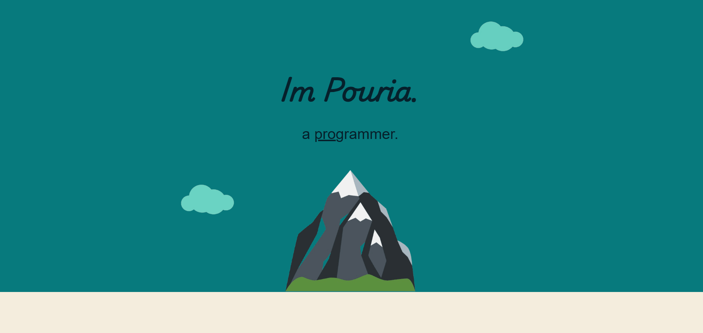

# Introduction

This is a personal introduction website built with **HTML**, **CSS**, **Bootstrap**, and **Canva** for design elements.  
The website features unique layouts and visuals, including buttons that navigate to two separate pages showcasing my **web design projects** and **3D printer works**.

---

## 🚀 Demo

You can view the live demo of the website here: [Introduction Demo](https://pouriavj.github.io/introduction/)

---

## 🖼️ Preview

  

---

## 🛠️ Built With

- HTML5  
- CSS3  
- [Bootstrap 5](https://getbootstrap.com/)  
- [Canva](https://www.canva.com/)  

---

## 📫 Contact

Links to GitHub, LinkedIn, and a contact page are included in the footer of the website.
